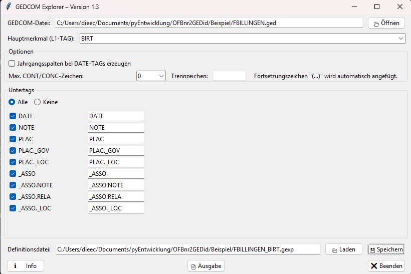

# 📘 **README.md (neu für Release 1.3)**

#  GEDCOM Explorer – Version 1.3

## Übersicht

**GEDCOM Explorer** ist ein Python‑Tool zur gezielten Extraktion strukturierter Daten eines `L1‑TAGs` und seiner Untertags (`L2–L4`) aus GEDCOM‑Dateien in eine Tabelle im `CSV`‑Format.

Die Anwendung bietet:

* eine moderne, benutzerfreundliche grafische Oberfläche (GUI), mit der man:
  - eine GEDCOM‑Datei auswählen,
  - einen spezifischen Level‑1‑TAG (L1‑TAG) bestimmen,
  - die dazugehörigen Untertags (z. B. `DATE`, `PLAC`, `NOTE`, …) mit Checkboxen auswählen,
  - eigene Spaltennamen für die CSV‑Ausgabe vergeben,
  - optional eine Jahrgangsspalte bei `DATE`‑Tags erzeugen kann,
  - Programmfestlegungen in einer Definitionsdatei im Format `.gexp` speichern und wieder laden kann.
* eine Konsolenversion (CLI), die in Batch‑Dateien verwendet werden kann.

> ℹ️ Begriffe werden in der **Projektbeschreibung** definiert.

---

## Bildschirmfoto



---

## Zweck des Programmes

### Problem des GEDCOM‑Formats
Das GEDCOM‑Format erlaubt freie TAG‑Werte ohne Syntaxprüfung. Dadurch können gleiche Informationen in unterschiedlichen TAGs abgelegt werden oder Projektkonventionen nicht eingehalten werden.

### Konsequenz
Eine systematische Auswertung genealogischer Daten wird erschwert oder unmöglich. Fehlerhafte oder inkonsistente Daten können sich über Jahre unbemerkt ansammeln.

### Problemlösung
Eine tabellarische Übersicht eines TAGs und seiner Untertags ermöglicht:

* schnelle Sichtprüfung der erfassten Werte,
* Syntax‑ und Konsistenzprüfungen in Tabellenkalkulationen oder Datenbanken,
* gezielte Korrekturen anhand des L0‑Zeigers in der GEDCOM‑Datei.

---

## Installation

### Voraussetzungen

- Python 3.8 oder höher  
- `ged_parser.py` und `ged_explorer.py` müssen im selben Verzeichnis liegen  
- `prg_logo.ico` muss im Ordner `images` vorhanden sein

### Installation der Abhängigkeiten

```bash
pip install tk
```

*(Unter Windows ist tkinter meist bereits vorinstalliert.)*

---

### Kompilieren

```bash
pyinstaller --onefile --windowed --icon=images/prg_logo.ico --add-data "images/prg_logo.ico;images" ged_explorer.py
```

---

## Verwendung

### GUI‑Oberfläche

```bash
python ged_explorer.py
```

1. GEDCOM‑Datei auswählen  
2. L1‑TAG eingeben oder aus Dropdown wählen (mit Auto‑Complete)  
3. Untertags auswählen und Spaltennamen anpassen  
4. (Optional) Jahrgangsspalten aktivieren  
5. **Ausgabe** klicken → CSV wird erzeugt  
6. Einstellungen als `.gexp`‑Definitionsdatei speichern (für spätere Wiederverwendung oder CLI)

### Konsolenmodus (CLI)

```bash
python ged_explorer.py --konsole definition.gexp
```

---

## Dateiaufbau

* `ged_explorer.py` – GUI‑Anwendung und CLI‑Steuerung  
* `ged_parser.py` – Logik zur GEDCOM‑Verarbeitung und CSV‑Erzeugung  
* `images/` – Programmsymbole und Ressourcen

---

## Ausgabe

Die erzeugte CSV‑Datei trägt denselben Namen wie die GEDCOM‑Datei, ergänzt um den gewählten L1‑TAG:

```
familie.ged → familie_BIRT.csv
```

---

## Hauptmerkmale

* **L1‑TAG Auswahl**  
  - Auto‑Complete  
  - Live‑Filterung  
  - ENTER‑Bestätigung  
  - automatische Validierung  
  - Fokus‑Validierung mit Fehlermeldung  
  - Auswahl per Dropdown oder Tastatur

* **Untertags (L2–L4)**  
  - Checkbox‑Auswahl  
  - benutzerdefinierte Spaltennamen  
  - Auswahl „Alle“ oder „Keine“  
  - Mindesthöhe des Untertag‑Bereichs  
  - dynamische Anpassung an Fenstergröße

* **CSV‑Erzeugung**  
  - robuste Verarbeitung  
  - Ausgabe vollständiger Datensätze  
  - automatische Jahrgangsspalten bei `DATE`

* **Definitionsdateien (.gexp)**  
  - Speichern aller Einstellungen  
  - automatischer Dateiname `<GEDCOM>_<L1‑TAG>.gexp`  
  - Laden für GUI oder CLI

* **CLI‑Modus**  
  - ideal für Batch‑Verarbeitung  
  - vollständige Automatisierung möglich

---

## Einschränkungen

* `CONT` und `CONC` werden nicht einzeln ausgewertet  
  → stattdessen Fortsetzungszeichen `(...)`  
* mehrfach vorkommende Untertags gleichen Namens werden zusammengeführt  
  → Trennung durch ` || `

---

## Lizenz

Dieses Projekt ist unter der MIT‑Lizenz lizenziert.

---

## Autor

Dieter Eckstein – 2025  
https://www.carosaar.de

